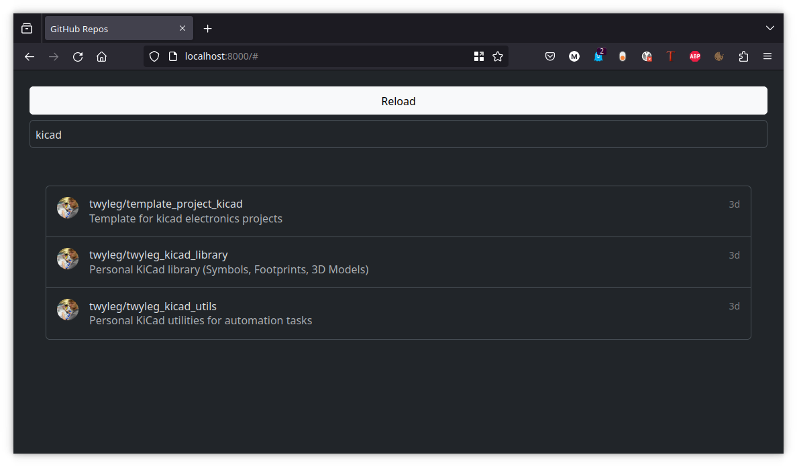
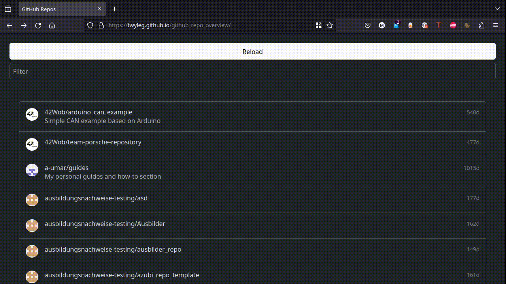
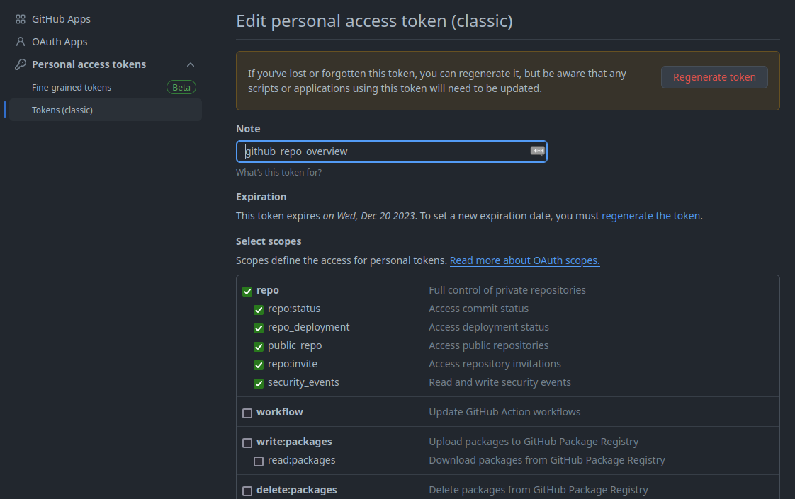
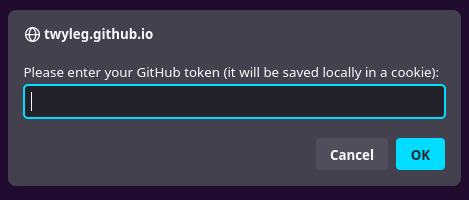

# Github Repo Overview

**[twyleg.github.io/github_repo_overview](https://twyleg.github.io/github_repo_overview)**

I noticed that GitHub often misses repositories when I use the quick search on the left sidebar.

I also work on various different organizations and the GitHub search wants me to switch Orgs before I can search for a particular repo. It's only a few clicks but it annoys me in my day to day work.

There might be a better search function already existing (on the GitHub page itself or somewhere else) but I was looking for a use case for bootstrap anyway so I decided to write a little repo overview myself.

In action:

## Authentication

The project uses the official [GitHub REST-API](https://docs.github.com/en/rest?apiVersion=2022-11-28) and makes extensive use of the [list-repositories-for-the-authenticated-user](https://docs.github.com/en/rest/repos/repos?apiVersion=2022-11-28#list-repositories-for-the-authenticated-user) API-Call.

For Authentication you will need a GitHub access token (classic) with full control of private repositories ("repo"). Otherwise you will only see public repositories.

You will be asked of the token on your first visit. The token will be saved locally in a browser cookie.

## Run locally

Since the project is a static web application, run your favourite webserver to provide the project locally. For example:

    cd github_repo_overview/
    python -m http.server --directory ./
